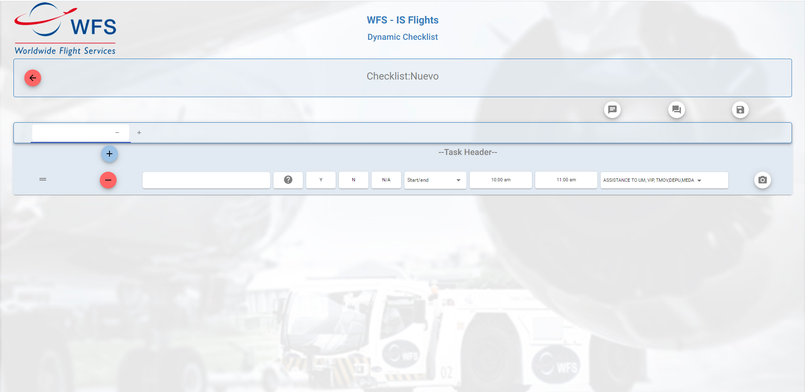
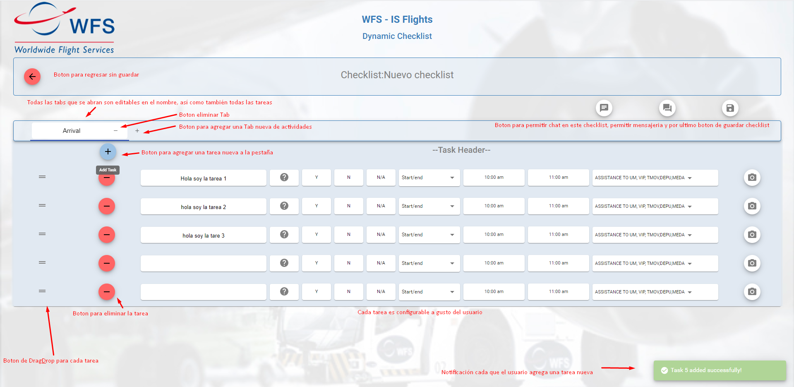

# Dynamic-Checklist
Sistema para llevar acabo los registros de tareas (Task, podrían ser abertura de primera puerta, limpieza avión etc.) por cada actividad (Tabs, podrían ser entrada y salida.) de los aviones de aeropuertos internacionales.

#Capturas de pantalla
### Pantalla inicio
el usuario debe de seleccionar alguna base o estación de los aeropuertos, para posteriormente agregar una checklist nuevo asociado a la base que seleccionó anteriormente, agregar uno nuevo desde una plantilla, o abrir uno existente

### Pantalla Inicio agregar checklist nuevo
Despues de seleccionar la base, en este caso fue DEN(DENVER) usuario tiene opcion de crear uno nuevo, se abre un dialog donde se debe introducir el nombre y el codigo del checklist a crear, ademas de un checkbox para marcar sin queremos comenzar desde una plantilla o no.

### Nuevo checklist
Nuevo sin plantilla.

estado inicial del checklist

### Pantalla Configurando un nuevo checklist
pequeña explicación para que es cada boton, al final de la configuración se guarda el checklist y se manda a la API indicada.

Haciendo Drag&Drop

### Pantalla Guardando Checklist
al darle al boton de save, se muestra un dialog con opción para cambiar el nombre al momento de guardar, un checkbox para guardarlo como plantilla o no, y un select para seleccionar las aerolineas que le vamos asignar a ese checklist en especial

