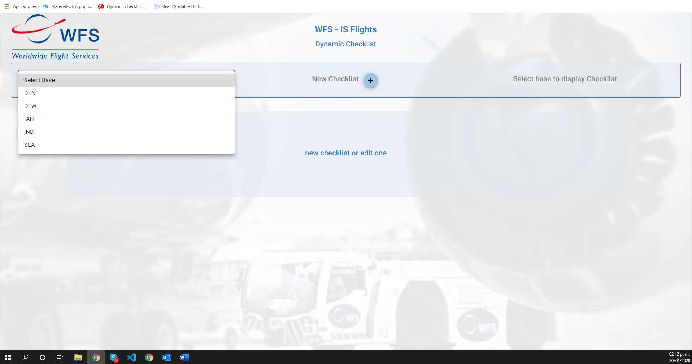
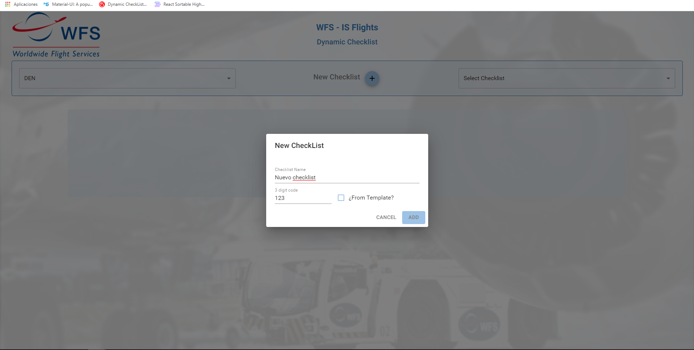

# Dynamic-Checklist
Sistema para llevar acabo los registros de tareas (Task, podrían ser abertura de primera puerta, limpieza avión etc.) por cada actividad (Tabs, podrían ser entrada y salida.) de los aviones de aeropuertos internacionales.

#Capturas de pantalla
### Pantalla inicio
el usuario debe de seleccionar alguna base o estación de los aeropuertos, para posteriormente agregar una checklist nuevo completamente, agregar uno nuevo desde una plantilla, o abrir uno existente

### Pantalla Inicio agregar checklist nuevo
Despues de seleccionar la base, en este caso fue DEN(DENVER) usuario tiene opcion de crear uno nuevo, se abre un dialog donde se debe introducir el nombre y el codigo del checklist a crear, ademas de un checkbox para marcar sin queremos comenzar desde una plantilla o no.

Nuevo sin plantilla.

Nuevo con plantilla.

Nombre y codigo validados.

Agregar uno con plantilla validado si no seleccionas alguno salta SnackBar

